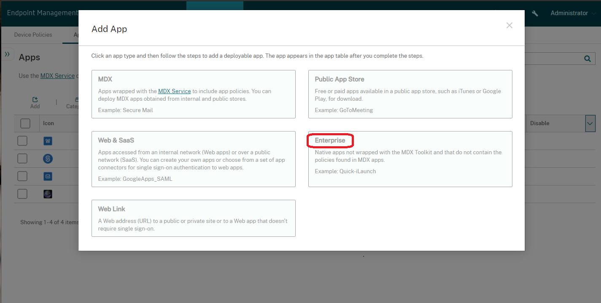
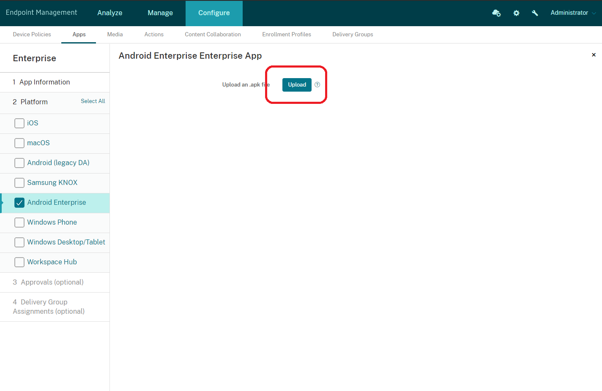
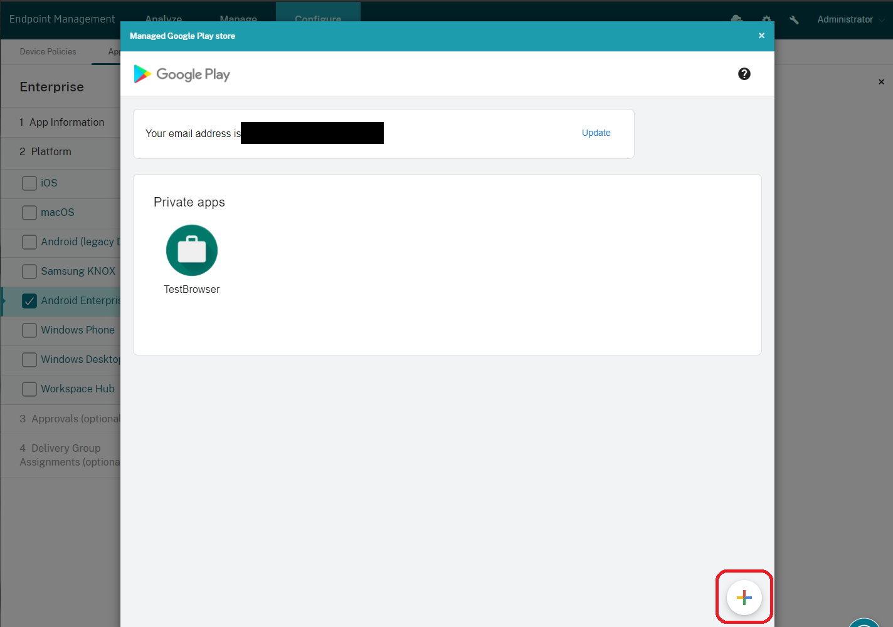
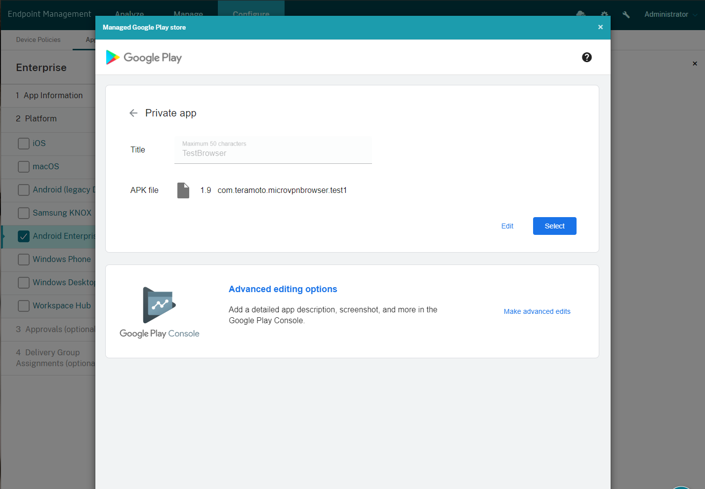
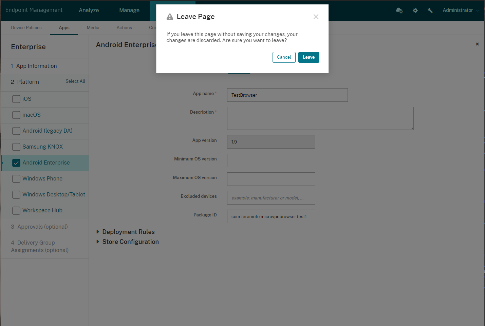
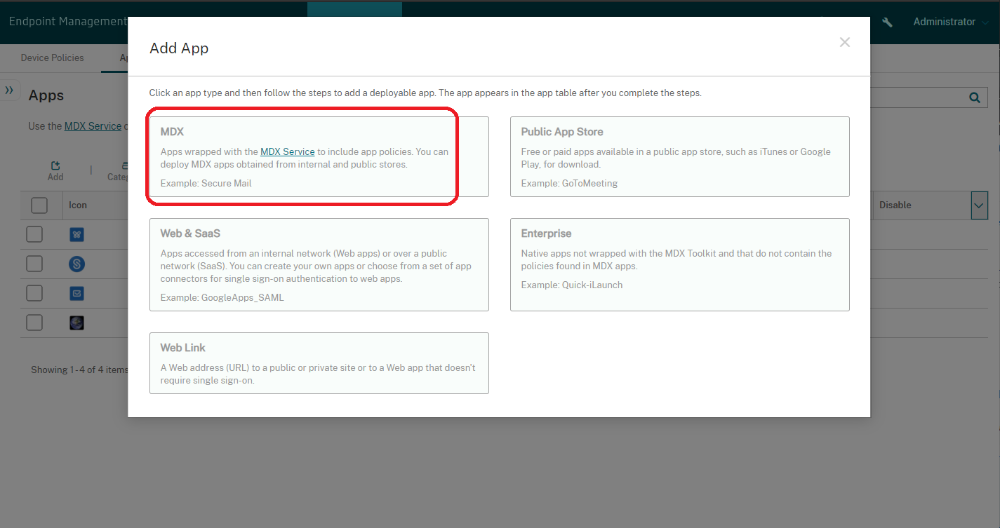
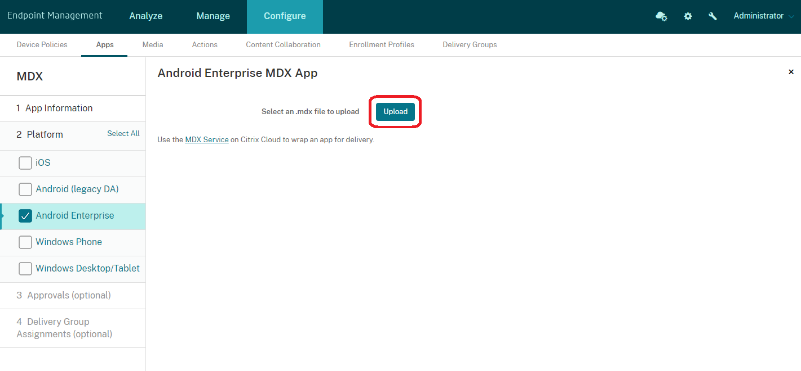
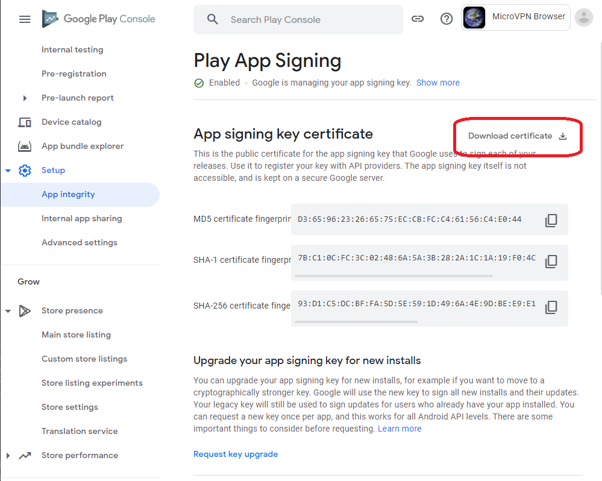

Micro VPN Browser
=================

A simple Android browser application that illustrates Citrix MAM SDK integration to support network tunneling to company's internal network: this is the source code for Micro VPN Browser app on [Google Play Store](https://play.google.com/store/apps/details?id=com.teramoto.microvpnbrowser).

Introduction
------------

[Citrix MAM SDK](https://docs.citrix.com/en-us/mdx-toolkit/mam-sdk-overview.html) is a set of libraries provided to Citrix Endpoint Management customers to integrate customer-developed apps to take advantage of Citrix's MAM features and capabilities.

[Citrix MAM SDK Documentation](https://developer.cloud.com/citrixworkspace/mobile-application-integration)

Citrix MAM SDK Version
----------------------

Micro VPN Browser supports the latest MAM SDK version 20.10.5.1.  

Getting Started
---------------

### Publishing Public App Store Micro VPN Browser to CEM Server
Download the MDX file (provided in the link below) and publish it as a regular public app store MDX app, similarly to Secure Mail and Secure Web.

<a id="raw-url" href="https://raw.githubusercontent.com/hteramoto2/mvpn-browser/master/MicroVPNBrowser.mdx">Download MDX File</a>


### Build an app for Managed Play Store Distribution (Private/Enterprise app)
#### Step 1
Before you can build this project, Citrix MAM SDK dependencies must be resolved manually.  The first step is to download the "MAM SDK for Android - Java" with the release date of Nov 17, 2020.

[Citrix MAM SDK Download link (Requires Citrix Account authentication)](https://www.citrix.com/downloads/citrix-endpoint-management/product-software/mdx-toolkit.html)

Unzip the downloaded MAM SDK file `MAM_SDK_for_Android_20.10.5.1.zip` to your project root folder\sdk\version.  The folder structure must look precisely as shown below.

```
mvpn-browser\sdk
└── 20.10.5.1
    ├── Documentation
    ├── Library
    └── SampleCode
```

#### Step 2
Set up signing keys for .mdx file generation step.  This can be done by creating a keystore.properties file at the project root folder.  The contents may look as below.  **Note:** Do not use double quotes for these values. 

```
keyAlias=key0
keyPassword=my5ecretP(a)ssword
storeFile=../../../AndroidKeyStore/keystore-file.jks
storePassword=my5ecretP(a)ssword2
```

#### Step 3
Micro VPN Browser app's Android Package Name is already used on the Google Play Store.  Any builds without modifying the package name will be rejected from the Play Store and the Managed Play Store.  To change the Package Name, create a debug.properties file at the project root folder.  The contents may look as below.  **Note:** Do not use double quotes for these values.

```
appPackageName=com.yourcompany.yourapp
versionCode=1
versionName=1.0
```

#### Step 4
Setup Citrix MAM SDK paths in the mamsdk.properties file.  Create this file at the project root folder.  The contens may look as below.  **Note:** Do not use double quotes and pass a full path to the downloaded MAM SDK package.

```
mamsdkMavenAbsolutePath=C:/Users/user1/AndroidStudioProjects/MicroVPNBrowser/sdk/20.10.5.1/Library/maven
mamSdkLibraryTools=C:/Users/user1/AndroidStudioProjects/MicroVPNBrowser/sdk/20.10.5.1/Library/tools
mamSdkLibraryLibs=C:/Users/user/AndroidStudioProjects/MicroVPNBrowser/sdk/20.10.5.1/Library/libs
mamSdkVersion=20.10.5.1
```

#### Step 5
Your application is now ready to be built.  Use the `gradlew build` command or use "Open an Exiting Project" in Android Studio.

#### Generating MDX File
To generate an MDX file for publishing as APK, run the following Gradle task:

```
    generateMdx
```

The MDX file will be located under `app\build\outputs\apk\release`.

#### Publishing to Managed Play Store
After generating the APK file and MDX file from the previously performed Gradle task, you will need to upload the app to the Managed Google Play Store and configure MDX on the CEM server.

##### Uploading APK to Managed Google Play Store
First, upload your APK file to Managed Google Play Store.  (Assumption: you have already configured Android Enterprise on the CEM Server.  If not, please refer to: [Android Enterprise](https://docs.citrix.com/en-us/citrix-endpoint-management/device-management/android/android-enterprise.html))



Start the APK upload process by clicking on the Upload button for Android Enterprise.


The Google Play iframe will open, allowing you to upload a new app or update an existing app.  Click the plus icon on the bottom right hand corner to upload a new app.


Upload your APK and provide the necessary details for publishing to the Managed Google Play Store.


It may take a few minutes for the app to become available on the Managed Google Play Store.  Leave/exit the Enterprise App Publishing flow.  Do not worry, the app would have been already uploaded to Google; Citrix does not need to know this nor record it in their databases.


Now, publish your MDX file to the CEM server.


Upload and finish publishing your MDX file.


Troubleshooting Guide
----------------------
I had my fair share of learning experience when developing this app.  I will attempt to use this section to help other developers who may run into the same issues.

### Issue 1: NoClassDefFoundError org/apache/http/HttpHost


    2021-04-27 19:11:23.145 13751-13967/? E/AndroidRuntime: FATAL EXCEPTION: pool-4-thread-1
        Process: com.teramoto.microvpnbrowser.test1, PID: 13751
        java.lang.NoClassDefFoundError: Failed resolution of: Lorg/apache/http/HttpHost;
            at com.citrix.mvpn.MAM.Android.AuthSSO.d.d.<init>(Unknown Source:9)
            at com.citrix.mvpn.MAM.Android.AuthSSO.d.d.a(Unknown Source:19)
            at com.citrix.mvpn.MAM.Android.AuthSSO.proxy.Helper.b(Unknown Source:70)
            at com.citrix.mvpn.MAM.Android.AuthSSO.proxy.Helper.a(Unknown Source:58)
            at com.citrix.mvpn.helper.b.a(Unknown Source:21)
            at com.citrix.mvpn.service.MITMService$b.run(Unknown Source:55)
            at java.util.concurrent.ThreadPoolExecutor.runWorker(ThreadPoolExecutor.java:1167)
            at java.util.concurrent.ThreadPoolExecutor$Worker.run(ThreadPoolExecutor.java:641)
            at java.lang.Thread.run(Thread.java:923)
        Caused by: java.lang.ClassNotFoundException: org.apache.http.HttpHost
            at com.citrix.mvpn.MAM.Android.AuthSSO.d.d.<init>(Unknown Source:9) 
            at com.citrix.mvpn.MAM.Android.AuthSSO.d.d.a(Unknown Source:19) 
            at com.citrix.mvpn.MAM.Android.AuthSSO.proxy.Helper.b(Unknown Source:70) 
            at com.citrix.mvpn.MAM.Android.AuthSSO.proxy.Helper.a(Unknown Source:58) 
            at com.citrix.mvpn.helper.b.a(Unknown Source:21) 
            at com.citrix.mvpn.service.MITMService$b.run(Unknown Source:55) 
            at java.util.concurrent.ThreadPoolExecutor.runWorker(ThreadPoolExecutor.java:1167) 
            at java.util.concurrent.ThreadPoolExecutor$Worker.run(ThreadPoolExecutor.java:641) 
            at java.lang.Thread.run(Thread.java:923) 

#### Cause

MAM SDK uses legacy Apache http library.  Your app will need to explicitly allow using this library.

#### Fix

Add the following in AndroidManifest.xml's `application` section.

    <uses-library android:name="org.apache.http.legacy" android:required="false" />

### Issue 2: Targeting `targetSdkVersion` to 30

Google has updated the [Play Store requirements](https://developer.android.com/distribute/best-practices/develop/target-sdk) to target SDK version to 30 for new apps for August 2021 and November 2021 for app updates.  MAM SDK integrated apps targeted for SDK version 30 will fail with this error.

    2021-04-27 19:36:05.530 16321-16387/? E/ActivityThread: Failed to find provider info for com.citrix.work.MDXProvider
    2021-04-27 19:36:05.530 16321-16387/? E/CORESDK-PolicyAPI: Failed to obtain ContentProviderClient for MDXProvider
    2021-04-27 19:36:05.530 16321-16387/? E/CORESDK-PolicyAPI: Failed to obtain ContentProviderClient for MDXProvider
    ...
    021-04-27 19:36:05.557 16321-16392/? E/"MVPN-SHTunnelConfig": "ERROR     ( 2)","Failed to obtain ContentProviderClient for MDXProvider"
    ...
    2021-04-27 19:36:05.557 16321-16387/? E/ActivityThread: Failed to find provider info for com.citrix.work.MDXProvider

#### Cause

Android SDK version 30 added new restriction to [package visiblity](https://developer.android.com/training/package-visibility).

#### Fix

Add the following in AndroidManifest.xml's `manifest` section.

    <queries>
        <package android:name="com.zenprise" />
        <package android:name="com.citrix.Receiver" />
    </queries>

### Issue 3: Generating MDX File for Android App Bundle and Play App Signing

App that uses Android App Bundle and Play App Signing cannot generate a correct MDX file.

#### Cause

Google has updated the Play Store requirement for new app to use the [Android App Bundle](https://developer.android.com/guide/app-bundle) starting August 2021.  Android App Bundle requires the developer to opt-in to [Play App Signing](https://play.google.com/console/about/keymanagement/). With Android App Bundle, your app will no longer generate the APK for submission to Play Store.  Also, Play App Signing will remove the burden for developers to safely manage their signing keys.  APK and signing keys are both required for generating MDX files, however.

#### Fix

Unfortunately, we will need to wait for a fix from Citrix.  You may want to attempt to contact Citrix to get further instructions.  When raising issue with Citrix, I suggest to download and provide the public signing certificate from Google Play Console to Citrix.

